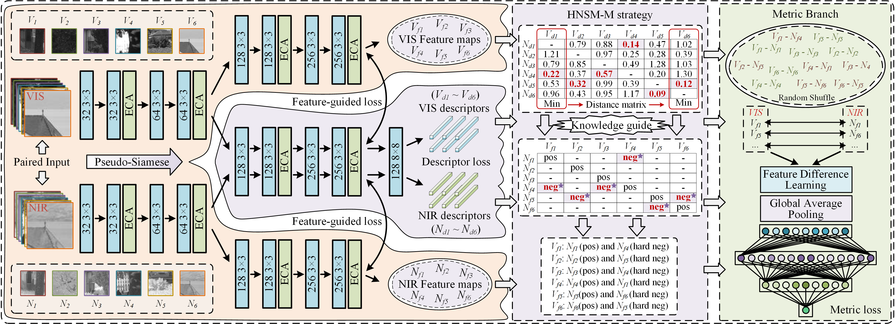

## The official complete code for paper "Why and How: Knowledge-Guided Learning for Cross-Spectral Image Patch Matching" [[Paper/arXiv](https://arxiv.org/abs/2412.11161)]  

<div align="center">
Recently, <b> cross-spectral image patch matching based on feature relation learning </b> has attracted extensive attention. However, <b>performance bottleneck problems</b> have gradually emerged in existing methods. To address this challenge, we make <b>the first attempt to explore a stable and efficient bridge</b> between descriptor learning and metric learning, and construct a <b>knowledge-guided learning network (KGL-Net)</b>, which achieves <b>amazing performance improvements while abandoning complex network structures</b>.
</div><br>

<p align="center">
  </br>
</p>  

<div align="center">
To the best of our knowledge, our KGL-Net is the first to implement hard negative sample mining for metric networks and brings significant performance improvements.
</div>

## Datasets
1. Original datasets
* **VIS-NIR patch dataset** [[Link1](https://ieeexplore.ieee.org/document/7789530)] [[Link2](https://ieeexplore.ieee.org/document/5995637)]  
* **VIS-LWIR patch dataset** [[Link1](https://ieeexplore.ieee.org/document/10251126)] [[Link2](https://ieeexplore.ieee.org/document/7789530)]  
* **OS patch dataset** [[Link1](https://ieeexplore.ieee.org/document/10164118)] [[Link2](https://ieeexplore.ieee.org/document/9204802)]
  
2. The datasets we created from original datasets (**can be used directly in our demo**)
* [💎 Download the dataset required by our code!!!](https://pan.baidu.com/s/1VssXkFsTwsbahIg6Q5Phag?pwd=1234)


## How to use our code
1. Download the dataset.
   
&nbsp;&nbsp;&nbsp;&nbsp;&nbsp;&nbsp;&nbsp;&nbsp;Click [download datasets](https://pan.baidu.com/s/1VssXkFsTwsbahIg6Q5Phag?pwd=1234)  

&nbsp;&nbsp;&nbsp;&nbsp;&nbsp;&nbsp;&nbsp;&nbsp;Unzip the downloaded compressed package to the root directory of the project.  

2. Creat a Anaconda Virtual Environment.  
   
   ```
    conda create -n KGL-Net python=3.8 
    conda activate KGL-Net 
   ```

3. Configure the running environment. (For the dependency library version error that occurs when installing "numpy==1.21.1", just ignore the error. It will not affect subsequent operations.)
   
   ```
    pip install torch==1.13.1+cu116 torchvision==0.14.1+cu116 torchaudio==0.13.1 --extra-index-url https://download.pytorch.org/whl/cu116
    pip install segmentation_models_pytorch -i https://pypi.tuna.tsinghua.edu.cn/simple
    pip install PyWavelets -i https://pypi.tuna.tsinghua.edu.cn/simple
    pip install scikit-image -i https://pypi.tuna.tsinghua.edu.cn/simple
    pip install albumentations==1.3.0 -i https://pypi.tuna.tsinghua.edu.cn/simple
    pip install scikit-learn matplotlib thop h5py SimpleITK medpy yacs torchinfo
    pip install opencv-python -i https://pypi.doubanio.com/simple
    pip install imgaug -i https://pypi.doubanio.com/simple
    pip install numpy==1.21.1 -i https://pypi.doubanio.com/simple
    ```

4. Training the model.  
   
    The default dataset is OS patch dataset. You can modify the default setting in the code directly. Or use the following command directly.<br>
    ```
    python train_KGL-Net.py --train_set='os_train'  --epoch_max=200  --dim_desc=128  --lr_scheduler='None'
    #### 'os_train': OS patch dataset,   'country': VIS-NIR patch dataset,   'lwir_train': VIS-LWIR patch dataset
    ```
    
6. Testing the Model.  
     
    The default dataset is OS patch dataset. You can modify the default setting in the code directly. Or use the following command directly.<br>
    
    ```
    python test_KGL-Net.py  --train_set='os_train'  --train_out_fold_name='train_KGL-Net_HyNet_os_train_epochs_200_sz_64_pt_256_pat_2_dim_128_alpha_2_margin_1_2_drop_0_3_lr_0_005_Adam_None_aug'
    #### python test_KGL-Net.py  --train_set='×××'  --train_out_fold_name='***'    # '***' denotes the folder name where the generated model is located. 
    ```

## Results

* **Quantative Results on the VIS-NIR patch dataset (VIS-NIR)**:
<p align="center">
  <span align="center"> 
  
</p>

* **Quantative Results on the VIS-LWIR patch dataset (VIS-LWIR)**:
<p align="center">
  <span align="center">
  
</p>

* **Quantative Results on the OS patch dataset (VIS-SAR)**:
<p align="center">
  <span align="center">  
  
</p>

* **Qualitative Results**:
<p align="center">
  <span align="center">  
  
</p>
<div align="center">
Each cross-spectral scene is from top to bottom: correctly judged as matching, correctly judged as non-matching, misjudged as matching, and misjudged as non-matching.
</div><br>


<!--
* **Comprehensive performance on the VIS-NIR patch dataset**:
<p align="center">
  <span align="center">  
  
</p>
-->

## Citation

Please cite our paper in your publications if our work helps your research. <br>
BibTeX reference is as follows:
```
@misc{yu2024howknowledgeguidedlearningcrossspectral,
      title={Why and How: Knowledge-Guided Learning for Cross-Spectral Image Patch Matching}, 
      author={Chuang Yu and Yunpeng Liu and Jinmiao Zhao and Xiangyu Yue},
      year={2024},
      eprint={2412.11161},
      archivePrefix={arXiv},
      primaryClass={cs.CV},
      url={https://arxiv.org/abs/2412.11161}, 
}
```

word reference is as follows:
```
Chuang Yu, Yunpeng Liu, Jinmiao Zhao, and Xiangyu Yue. Why and How: Knowledge-Guided Learning for Cross-Spectral Image Patch Matching. arXiv preprint arXiv:2412.11161, 2024.
```

## Other link

1. My homepage: [[YuChuang](https://github.com/YuChuang1205)]


